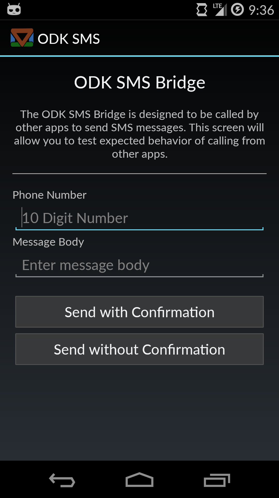

# ODK SMS Bridge

> An app for sending SMS messages with and without user confirmation.

## Overview

The ODK SMS Bridge lets you send SMS messages with an
[Intent](http://developer.android.com/reference/android/content/Intent.html).
Sending SMS messages via Intents is supported by default in Android.
Unfortunately, doing so always launches a messaging app and requires user
confirmation.

Android 4.4 introduced the [SmsManager](
http://developer.android.com/reference/android/telephony/SmsManager.html),
which lets you send messages without an external app. However! There is no way
to trigger it using an Intent.

This app is a small wrapper around both methods that lets you use either
technique via an Intent. A `require_confirmation` boolean variable selects
which method is used.

## Usage

The ODK SMS Bridge is designed to be called from other apps via Intents.
However, the welcome screen of the app lets you enter a phone number and
message body and send messages using both supported techniques: with and
without user confirmation.

In this way you can see what the user will experience when using your app.

<p align="center">
  
</p>

### In Native Android Apps

Interact with the ODK SMS Bridge using an Intent. Arguments maybe be passed in
the extras [Bundle](
http://developer.android.com/reference/android/os/Bundle.html).

The code below sends a message to number `3605551234` with the content `This is
a fancy message.`.

```java
Intent intent = new Intent();

ComponentName componentName = new ComponentName(
    "org.opendatakit.smsbridge",
    "org.opendatakit.smsbridge.activity.SMSDispatcherActivity");

intent.setComponent(componentName);

Bundle bundle = new Bundle();

// False to send an SMS immediately without the user stepping in.
// True to require user intervention.
bundle.putBoolean("require_confirmation", false);
bundle.putString("message_body", "This is a fancy message.");
bundle.putString("phone_number", "3605551234");

intent.putExtras(bundle);

context.startActivity(intent);
```

### In ODK Survey

The ODK SMS Bridge can also be called from [ODK Survey](
http://opendatakit.org/use/2_0_tools/odk-survey-2-0-rev122/) by defining a
custom prompt type. See the [ODK page](
http://opendatakit.org/use/2_0_tools/older-versions/odk-application-designer-v2-0-alpha-1/odk-xlsxconverter-v2-0-beta-2/#customizingPrompts)
for more information.

Custom prompts are defined in a file called `customPromptTypes.js`.
If your form ID is `my_form`, and the ID of the table this form saves data to
is `my_table`, the full path of this file would be
`app/my_table/forms/my_form/customPromptTypes.js`.

In this example we'll define a new prompt type called `send_sms` and use it in
a form.

First, let's set up our form. It will consist of three prompts: a name, a phone
number, and the button that sends an SMS.

This will require three worksheets: `survey`, `prompt_types`, and `settings`.

Our `survey` sheet will look like this:

| type     | name     | display.text |
|----------|----------|--------------|
|text      | name     | Enter a Name |
|text      | phone\_number| Enter a Phone Number |
|send\_sms  | send\_message| Send an SMS |

Our `prompt_types` sheet will define our custom `send_sms` type:

| prompt\_type\_name  |  type  |
|-------------------|--------|
| send\_sms          | integer |

> Note! In this example we're not actually saving anything in this prompt, so
the type doesn't matter.

And finally our `settings` sheet looks like this:

| setting\_name | value | display.title |
| ------------- | ----- | ------------- |
| form\_id       | sms\_example | 
| form\_version  | 20141011    |
| survey        |             | SMS Example
| table\_id      | sms\_example |

And now we need to tell Survey what to do with our custom prompt type. This
happens in the `customPromptTypes.js` file, which should be placed in the same
directory as the `.xlsx` file defining the form and the `formDef.json` file.

```javascript

define(['promptTypes', 'jquery', 'underscore', 'prompts'],
    function(promptTypes, $, _, prompts) {
        return {
          'send_sms': promptTypes.launch_intent.extend({
            type: 'send_sms',
            datatype: 'send_sms',
            buttonLabel: {
              'default': 'Send an SMS'
            },
            // The bulk of this function was taken from a launch_intent prompt
            // in prompts.js. This is only needed if you need to access data
            // collected in the same form when sending an SMS. All the
            // statements except those beginning with that.intentParameters
            // need to remain in order to preserve normal functionality.
            configureRenderContext:
              function(ctxt) {
                var that = this;
                var value = that.getValue();
                // We'll overwrite the default message with our custom message.
                that.intentParameters.extras.message_body =
                    'Hello, ' +
                    that.database.getDataValue('name') +
                    '!';
                that.intentParameters.extras.phone_number =
                    that.database.getDataValue('phone_number');
                that.renderContext.value = value;
                that.renderContext.buttonLabel = that.buttonLabel;
                ctxt.success();
              },
            intentString: 'org.opendatakit.smsbridge.activity.SMSDispatcherActivity',
            intentParameters: {
              extras: {
                require_confirmation: true,
                message_body: 'Default message body',
              }
            }
          })
        };
      });
```

> Note! If you don't want to require user confirmation, set the
`require_confirmation` variable to false. However, be aware that the app
currently doesn't aim to gracefully handle the case where there is no cell
service.

The generated form will have three questions on three different
screens. The first will collect a name, the second a number, and the third will
be a button that sends an SMS. Clicking the button will ask for user
confirmation and send a message saying hello to the entered phone number.

<p align="center">
  
</p>


## Architecture

SMS messages are sent by the [SMSDispatcherActivity](#). This activity has no
user interface. It interprets arguments passed via an Intent (see Usage) and
finishes immediately. This is the Activity callers should invoke.

The main screen of the app is the [WelcomeActivity](#). It exists to allow
users to see what interactions with the `SMSDispatcherActivity` are like. Two
buttons let you send a message with or without user confirmation to give you a
sense of the different user experiences.

## Building and Contributing

The original structure of the project came from [deckard-gradle](
https://github.com/robolectric/deckard-gradle). Follow their setup instructions
to build the project.

It uses the [Android Gradle build system](
http://tools.android.com/tech-docs/new-build-system).


### Tests

Tests can be run from the root directory with the command
`./gradlew clean test`.

They can also be run within IntelliJ, provided you
follow the setup instructions from deckard-gradle.

## Not Currently Supported by Core ODK Team

This app is currently not supported by the core [Open Data Kit (ODK)](
http://opendatakit.org/) team.

However, this **is** a supported project. Feel free to open issues and use it,
but for now you can't necessarily count on support from the entire ODK core
team.
